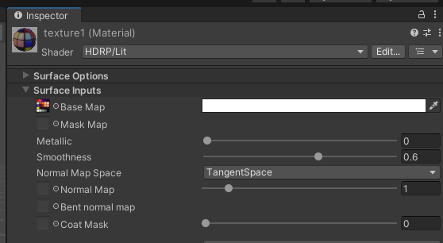

# Unity & Asset Bundles
---
# Making a new Unity project for your mod
	NOTE: You can use the asset rip project if you really want to but it's 
	kind of unclean so I reccomend having a separate unity project for your mod
- Extract the [unity project template](https://github.com/EvaisaDev/LethalCompanyUnityTemplate) from its zip again, rename it something like "UnityProject", place that folder in your VS project's root directory (not the .csproj one) and follow the rest of it's instructions

---
	NOTE: having the asset dump project open too could be useful for reference? 

# Importing assets & where
	TODO: Not sure if I should get into Blender or other 3D programs here. this is where it would go though

For the sake of adding a new scrap item (with grab & drop sounds), you will need:
- A model (this can be an FBX file or the Blender project file (.blend) if you were using one)
- The texture (PNG)
- The sounds you plan on using (you may have to lower their volume, use existing sounds from the game as reference for loudness)

A good practice would be to have each seperate peice of your mod in its own folder. You can choose your own structure at the end of the day, though. For my mod, I'm going to make a folder inside my `Assets` folder called `Scrap` and in that folder another one called `Gino`, the final path being `Assets/Scrap/Gino/`, and putting all the files in there. Here's what it looks like afterwards:

You'll notice the model isn't in perfect condition just yet. Unity provides a bunch of settings during import. The only one thats important this time around would be extracting the materials so we can modify them. The setting would be located under `Materials`, and after you press `Extract Materials...` send the file to the same folder (`Assets/Scrap/Gino`) that you're currently working in.

If you select the now extracted material, the one thing you'll need to do to get textures working is to drag your texture PNG into the little box next to the words `Base Map`

	TODO: check how mutli material models work

## Creating a new [Prefab](https://docs.unity3d.com/Manual/Prefabs.html)
Before we get started working on it, it's gotta be contained in a prefab.

In Unity's `Project` view (the files), right click and choose `Create>Prefab` and give it a good name (I'll be using "GinoScrap"). This is going to be the thing the game spawns into the level. Double-click it to open it so we can start adding stuff to it.

# Making the Scrap Item
Currently, it's an empty GameObject (basically a point in space and nothing else). Using a scrap item from the game as reference, we're going to add all the parts necessary for it to work ingame.

	NOTE: (This is why I have my asset rip project open)

### The Object
Right at the top, under the name, make sure it has the correct Tag and Layer. The BigBolt has `PhysicsProp` and `Props` so we'll use that. 

### Mesh Filter & Mesh Renderer
You can do both these steps by just dragging the mesh from your model into the Inspector. To make the material work, drag it into the `Material` list in the `Mesh Renderer` component.

	NOTE: would removing the Decal Layer Default from the Rendering Layer Mask be important?

### Box Collider
If you dragged the mesh from your model into the Inspector, it will already have a `Mesh Collider` on it. We don't actually want that. Remove it and add a `Box Collider` instead. It'll automatically wrap around the model. Adjust if needed.

### Audio Source
Just imitate the reference. No sounds need to be put into it right now You can tweak these for yourself later. (Differences: `Play on Awake` to `false`, `Spatial Blend` to `1`, all 3D Sound Settings)

## THE SCRIPTS
Time to add all the scripts. The Unity project template provides fake versions of the script to reference and put values into. BepInEx turns those into references to the actual scripts.

### "Network Object"
Imitating the reference, only setteings that need to be changed this time are
`DontDestroyWithOwner = true` and `AutoObjectParentSync = false`

### "Physics Prop"
Add it, different setttings this time are `Grabbable = true`, `isInFactory = true`, `grabbableToEnemies = true`, and the `Item Properties`, which is a MonoBehavior. 

To create the properties for the item, go to the Project view again, right click and `Create>Scriptable Object>Item`. call it the same thing as your Scrap. Drag it into the box for `Item Properties`, and then double-click it to start modifying it.

You can get through most of this just copying from the reference object's properties, but the notable values to think about would be:

**Item Name:** Item's name when scanned/reported by the company

**Weight:** Just treat the part after the `1.` as the weight value in pounds, it's pretty close

**Max & Min Value:** Value ingame is chosen randomly between the min & max, and then multiplied by a number set by the map (around x0.47 for Experimentation)

**Player SFX:** Drag in those sounds here.

## Scan Node
The scan node isnt actually a component in the scrap object, it is instead a child object to the scrap object.

Right click your scrap in the Hierarchy and selecg `3D Object>Cube`. Scale it and move it to fit your object and the Box Collider should automatically be handled on its own. Don't forget to set it's Layer to `ScanNode`!

Add the **Scan Node Properties** script as well, and set its values, imitating the reference for everything except `Header Text`.

# ASSET BUNDLES
Now that the scrap item is done, it's time to add your stuff to an asset bundle! Unless you have a very good reason to, it's generally a good idea to have a single asset bundle for your mod, to avoid duplicating assets. When you add something like a prefab to an asset bundle, everything that it references in the properties of all the components will be included automatically, **but you won't be able to refer to them unless you manually add them to the bundle.** Manually add everything you plan on referring to by path in your code to the AssetBundle.

Select your scrap item (in the `Project` view, specifically), look all the way at the bottom of the `Inspector`, create a `New...` bundle (with the name of your mod, generally) and assign your scrap item to it. Assign your item properties file to this group as well.

## Building 
AssetBundle Browser is the tool for this job, and it comes included with the Lethal Company Unity Template. It's located in the menu bar, in `Window>AssetBundle Browser`.

Here you can check your asset bundle(s), delete the `modassets` bundle the template came with (no clue why its there) and `Build`!

For building, all of the settings there by default are fine, though you can change the output path if you'd like. I sent the bundle output to a folder at the root of the project called `AssetBundles`.

# Implementing your item in the code
Open the Visual Studio Community project back up. For the sake of the code I'll be seperating it from the main plugin, but just know that the method `Activate()` in the class `ScrapPatcher` is run at the end of `Awake()` in the `SamplePlugin` class with `ScrapPatcher.Activate();`.

	TODO: Tell people how to have the asset bundle automatically included

## 

	TODO: FINISH